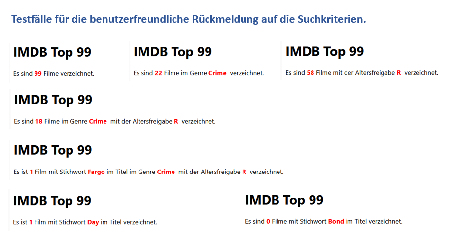
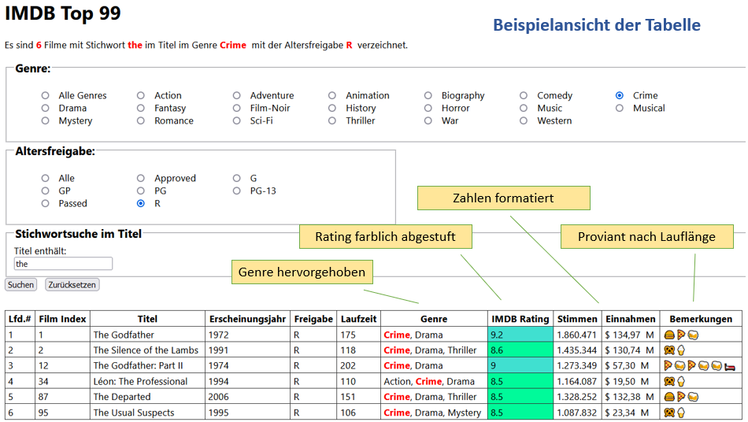

# IMDB Top Movies mit XSL und PHP durchsuchen

- Nutzen Sie bitte Ihre eigene Version der Movies-XML-Datei, die Sie aus der CSV-Datei extrahiert und entsprechend Ihrem XML-Schema strukturiert haben.
- Falls Sie diese frühere Aufgabe nicht abgeschlossen haben, steht Ihnen die Datei *imdb-top-99.xml* im Aufgabenordner zur Verfügung.

## Gewünschte Funktionen

- Auswahl des Film-Genres (dynamische Radio-Buttons), oder alle Genres.
- Auswahl aus den Kategorien der Altersfreigabe (dynamische Radio-Buttons), oder alle.
- Stichwortsuche im Film Titel.
- Die Suchkriterien sind mit logischem **und** verknüpft.
- Eine Text über dem Suchformular, der dem Benutzer dynamisch anzeigt, wonach er gesucht hat und wie viele Treffer er hat.
- Darstellung der gefundenen Filme als Tabelle.
- Wenn nichts gefunden wurde, wird der Tabellenkopf nicht angezeigt.
- Falls eine Genre gewählt wurde, wird dieses Genre unter den zutreffenden Genres der gefundenen Filme farblich hervorgehoben.
- Je nach Rating, werden die Filme farblich abgestuft angezeigt (CSS-Klassen verwenden).
- Die Zahlen in den Spalten Stimmen und Einnahmen sind mit Dezimalkomma und Tausendertrennzeichen formatiert.
- Die Laufzeit wird mit Empfehlungen kommentiert, wie viel Proviant für die Sitzung benötigt wird (Emojis).

## Tipps

- Da jeder Film mehreren Genres zugeordnet sein kann, benötigen Sie in dieser Spalte eine **unterschachtelte xsl:for-each Schleife**.
- Zur Erzeugung der Genre-Radio-Buttons ist der Schleifenpfad **select="//genre"**

## Testfälle

Der Benutzer soll klare Rückmeldung bekommen, nach was er gesucht hat und wie viele Filme gefunden wurden. Hier sind ein paar Testfälle zum ausprobieren.

## Ansichtsbeispiel für die Tabelle

